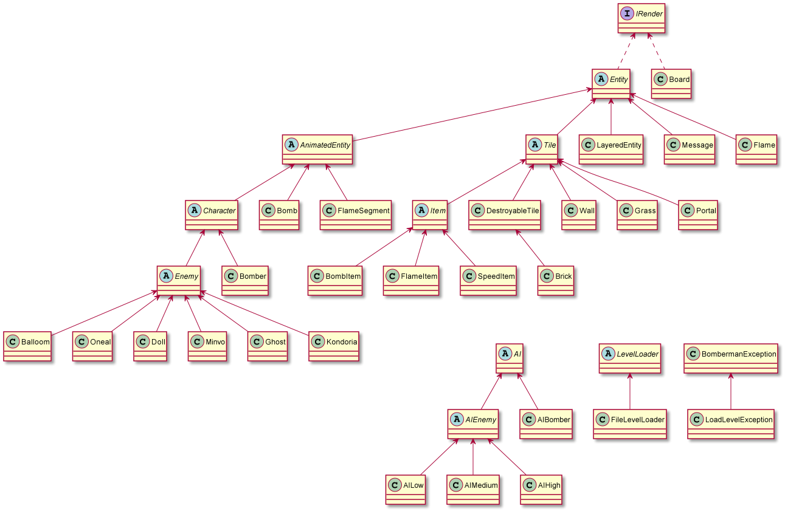
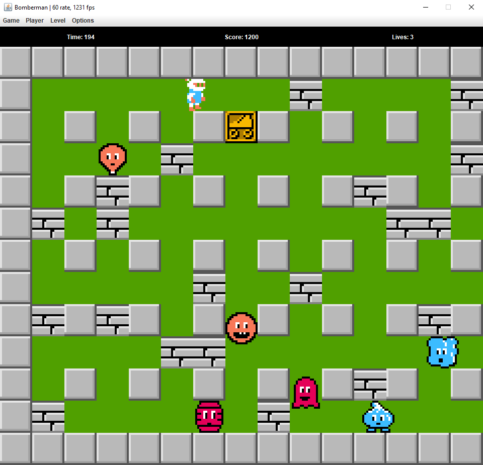

# Bomberman Game

## Contributors

- [Nguyễn Văn Hưng (20021370) - K65-T-CLC](https://github.com/hth125192)
- [Nguyễn Huỳnh Trà My (20020223) - K65-CA-CLC3](https://github.com/nhtm2702)
- [Hoàng Nguyễn Minh Trang (20020237) - K65-CA-CLC3](https://github.com/HoangTrang150302)

## Introduction

Bài tập lớn số 2 - Bomberman (UET OASIS - I2122 INT2204 24 - Lập trình hướng đối tượng)

## Description

### Entities

Nếu bạn đã từng chơi Bomberman, bạn sẽ cảm thấy quen thuộc với những đối tượng này. Chúng được được chia làm hai loại chính là nhóm đối tượng động (*Bomber*, *Enemy*, *Bomb*) và nhóm đối tượng tĩnh (*Grass*, *Wall*, *Brick*, *Portal*, *Item*)

-  *Bomber* là nhân vật chính của trò chơi. *Bomber* có thể di chuyển theo 4 hướng trái/phải/lên/xuống theo sự điều khiển của người chơi
-  *Enemy* là các đối tượng mà *Bomber* phải tiêu diệt hết để có thể qua level. *Enemy* có thể di chuyển ngẫu nhiên hoặc tự đuổi theo *Bomber* tùy theo loại *Enemy*. Các loại *Enemy* sẽ được mô tả cụ thể ở phần dưới
-  *Bomb* là đối tượng mà *Bomber* sẽ đặt và kích hoạt tại các ô *Grass*. Khi đã được kích hoạt, *Bomber* và *Enemy* không thể di chuyển vào vị trí *Bomb*. Tuy nhiên ngay khi *Bomber* vừa đặt và kích hoạt *Bomb* tại ví trí của mình, *Bomber* có một lần được đi từ vị trí đặt *Bomb* ra vị trí bên cạnh. Sau khi kích hoạt 2s, *Bomb* sẽ tự nổ, các đối tượng *Flame*  được tạo ra
-  *Grass* là đối tượng mà *Bomber* và *Enemy* có thể di chuyển xuyên qua, và cho phép đặt *Bomb* lên vị trí của nó
-  *Wall* là đối tượng cố định, không thể phá hủy bằng *Bomb* cũng như không thể đặt *Bomb* lên được, *Bomber* và *Enemy* không thể di chuyển vào đối tượng này
-  *Brick* là đối tượng được đặt lên các ô *Grass*, không cho phép đặt *Bomb* lên nhưng có thể bị phá hủy bởi *Bomb* được đặt gần đó. *Bomber* và *Enemy* thông thường không thể di chuyển vào vị trí *Brick* khi nó chưa bị phá hủy
-  *Portal* là đối tượng được giấu phía sau một đối tượng *Brick*. Khi *Brick* đó bị phá hủy, *Portal* sẽ hiện ra và nếu tất cả *Enemy* đã bị tiêu diệt thì người chơi có thể qua level khác bằng cách di chuyển vào vị trí của *Portal*

Các *Item* cũng được giấu phía sau *Brick* và chỉ hiện ra khi *Brick* bị phá hủy. *Bomber* có thể sử dụng *Item* bằng cách di chuyển vào vị trí của *Item*. Thông tin về chức năng của các *Item* được liệt kê như dưới đây:

-  *SpeedItem* Khi sử dụng *Item* này, *Bomber* sẽ được tăng vận tốc di chuyển thêm một giá trị thích hợp
-  *FlameItem* Giúp tăng phạm vi ảnh hưởng của *Bomb* khi nổ (độ dài các *Flame* lớn hơn)
-  *BombItem* Thông thường, nếu không có đối tượng *Bomb* nào đang trong trạng thái kích hoạt, *Bomber* sẽ được đặt và kích hoạt duy nhất một đối tượng *Bomb*. *Item* này giúp tăng số lượng *Bomb* có thể đặt thêm một

Có rất nhiều loại *Enemy* trong Bomberman, tuy nhiên trong phiên bản này nhóm chỉ cài đặt 6 loại *Enemy* dưới đây:

-  *Balloom* là *Enemy* đơn giản nhất, di chuyển ngẫu nhiên với vận tốc cố định
-  *Oneal* di chuyển "thông minh" hơn so với Balloom (biết đuổi theo *Bomber*)
-  *Doll* di chuyển ngẫu nhiên như *Balloom* nhưng với vận tốc nhanh hơn
-  *Minvo* có tốc độ di chuyển thay đổi, lúc nhanh, lúc chậm và biết đuổi theo *Bomber* như *Oneal*
-  *Ghost* có tốc độ di chuyển thay đổi, biết duổi theo *Bomber* và có thể đi xuyên qua *Brick*
-  *Kondoria* có tốc độ tỉ lệ với tốc độ của *Bomber*, biết duổi theo *Bomber* với cách di chuyển tối ưu nhất và có thể đi xuyên qua *Brick*

### Game play, collision and explosion

- Trong một màn chơi, *Bomber* sẽ được người chơi di chuyển hoặc di chuyển theo AI Bomber, đặt và kích hoạt *Bomb* với mục tiêu chính là tiêu diệt tất cả *Enemy* và tìm ra vị trí *Portal* để có thể qua màn mới
- *Bomber* sẽ bị giết khi va chạm với *Enemy* hoặc thuộc phạm vi *Bomb* nổ. Khi *Bomber* hết sinh mạng, trò chơi sẽ kết thúc
- *Enemy* bị tiêu diệt khi thuộc phạm vi *Bomb* nổ
- Một đối tượng thuộc phạm vi *Bomb* nổ có nghĩa là đối tượng đó va chạm với một trong các tia lửa được tạo ra tại thời điểm một đối tượng *Bomb* nổ
- Khi *Bomb* nổ, một *Flame* trung tâm tại vị trí *Bomb* nổ và bốn *Flame* tại bốn vị trí ô đơn vị xung quanh vị trí của *Bomb* xuất hiện theo bốn hướng trên/dưới/trái/phải. Độ dài bốn *Flame* xung quanh mặc định là 1 đơn vị, được tăng lên khi *Bomber* sử dụng các *FlameItem*
- Khi các *Flame* xuất hiện, nếu có một đối tượng thuộc loại *Brick*/*Wall* nằm trên vị trí một trong các *Flame* thì độ dài *Flame* đó sẽ được giảm đi để sao cho *Flame* chỉ xuất hiện đến vị trí đối tượng *Brick*/*Wall* theo hướng xuất hiện. Lúc đó chỉ có đối tượng *Brick*/*Wall* bị ảnh hưởng bởi *Flame*, các đối tượng tiếp theo không bị ảnh hưởng. Còn nếu vật cản *Flame* là một đối tượng *Bomb* khác thì đối tượng *Bomb* đó cũng sẽ nổ ngay lập tức

## Features

- Cây thừa kế cho các đối tượng
- Xây dựng bản đồ màn chơi từ tệp cấu hình
- Di chuyển Bomber theo sự điều khiển của người chơi
- Tự động di chuyển các Enemy
- Xử lý va chạm cho các đối tượng Bomber, Enemy, Wall, Brick, Bomb
- Xử lý bom nổ
- Xử lý khi Bomber sử dụng các Item và khi đi vào vị trí Portal
- Nâng cấp thuật toán tìm đường cho Enemy
- Cài đặt thêm 4 loại Enemy khác
- Cài đặt thuật toán AI cho Bomber
- Xử lý hiệu ứng âm thanh
- Thêm thông số sinh mạng trong game
- Thêm các tùy chọn trong game: new game, restart, pause, resume, change size
- ...

## Technologies

- IntelliJ IDEA Community Edition 2021.3
- Java SE Development Kit 17
- Java Swing, Java Awt
- Maven Framework
- PlantUML Integration

## Guide

Run -> Edit Configurations... -> Add new run configuration... -> Application
- Main class: BombermanGame.BombermanGame
- Name: BombermanGame

## Controls and Options

| Control | Key 1 | Key 2 |
|---------|-------|-------|
| UP      | W     | ↑     |
| DOWN    | S     | ↓     |
| LEFT    | A     | ←     |
| RIGHT   | D     | →     |
| BOMB    | SPACE | X     |

| Option   | Key       |
|----------|-----------|
| New Game | Ctrl + N  |
| Restart  | Shift + N |
| Pause    | Ctrl + P  |
| Resume   | Ctrl + R  |

## UML Diagram

## Preview

